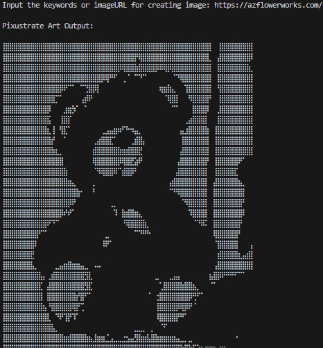
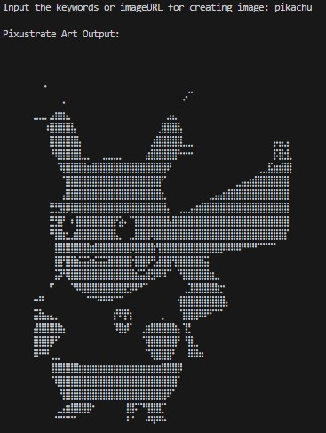

# Pixustrate

### What is [Pixustrate](https://easylandlord-e3923.web.app/)?
**Pixustrate** Python-based tool that instantly converts search **keywords** or **image URLs** into unique braille-style illustrations.

*🗣 Note: Try It Online (Hosted on Replit)*  
----------- Click here to use [Pixustrate](https://easylandlord-e3923.web.app/) ----------- 
 
 
 

### Used Language/Tools
  
   

### Website Interface

  
  

## License
This project is licensed under the MIT License — see the [LICENSE](LICENSE) file for details.
